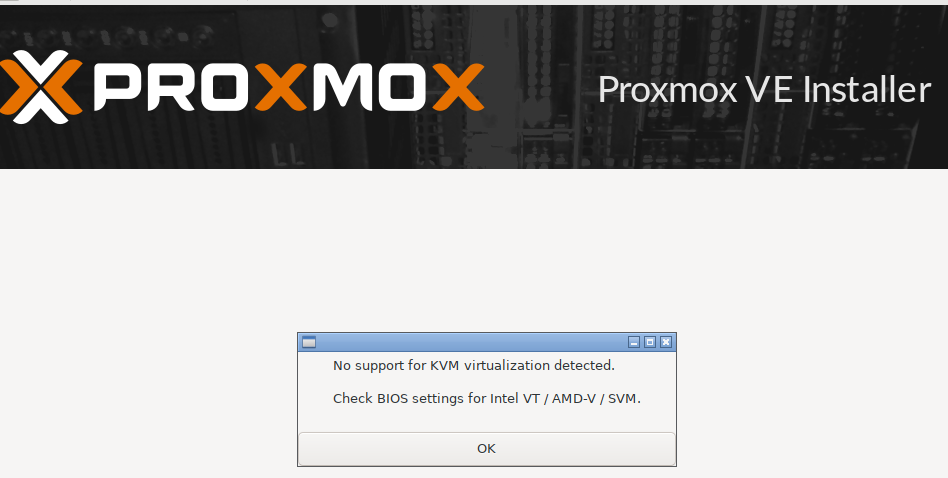
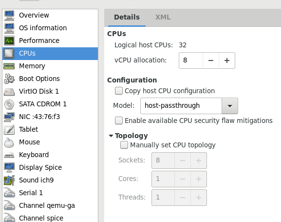
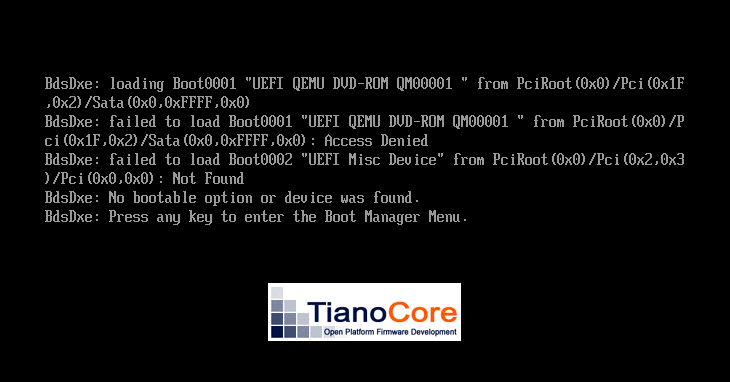

## Proxmox VE as Nested Hypervisor
### tested under RHEL8.6 and AMD processor

0. The problem:  

  

And this is because I am not installing it on a bare metal, it is a VM inside KVM.  


1. Activate nested virt on the real host:  

```bash
[root@dl385 modprobe.d]# pwd
/etc/modprobe.d
[root@dl385 modprobe.d]# cat kvm.conf 
# Setting modprobe kvm_intel/kvm_amd nested = 1
# only enables Nested Virtualization until the next reboot or
# module reload. Uncomment the option applicable
# to your system below to enable the feature permanently.
#
# User changes in this file are preserved across upgrades.
#
# For Intel
#options kvm_intel nested=1
#
# For AMD
options kvm_amd nested=1
[root@dl385 modprobe.d]# 
``` 

Have the same file with kvm_amd as name:  

`cp -p kvm.conf kvm_amd.conf`  

Reload the KVM module:  

`m̀odprobe -r kvm_amd`   
`m̀odprobe kvm_amd`   

Or simply reboot the host  

2. Choose the right CPU topology for the hypervisor VM.  

**Alternative 1:**   
Go to the BIOS settings of the machine and toggle the VTx or SVx to enqble Virtualization  
the problem is I havent found an efficient way to get into a KVM machine bios ...  
Thus, I chose EFI as firmware (TianoCore) and just by pressing 'escape' at the boot, I have the EFI settings menu  
Unfortunately, I couldn't find the CPU advanced settings nowhere !  

**Alternative 2:**  
Base the CPU model on the Host CPU (since this one already has the virtualization enabled)  
the best bet here is to do some granular simple tests and check the information from **/cpu/procinfo**  
Create a dummy VM (with a minimal Linux OS) and play with the CPU topology.  
Evrytime you pick a topo, check the flags SVM OR VMX with cat /proc/cpuinfo.  
It turned out that cpu topology HOST-PASSTHROUGH worked.  
(even the topologies 'hypervisor default' and 'host-model' didnt work)   
Pro for the passthrough model is that it gives max perf  
Con for it, is live migration will probably be impossible unless it is being migrated to an identical host  

  

  

3. This error might surface:  



Go to the settings in UEFI and disable secure boot.  


