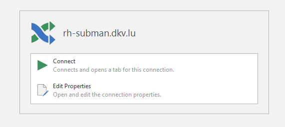
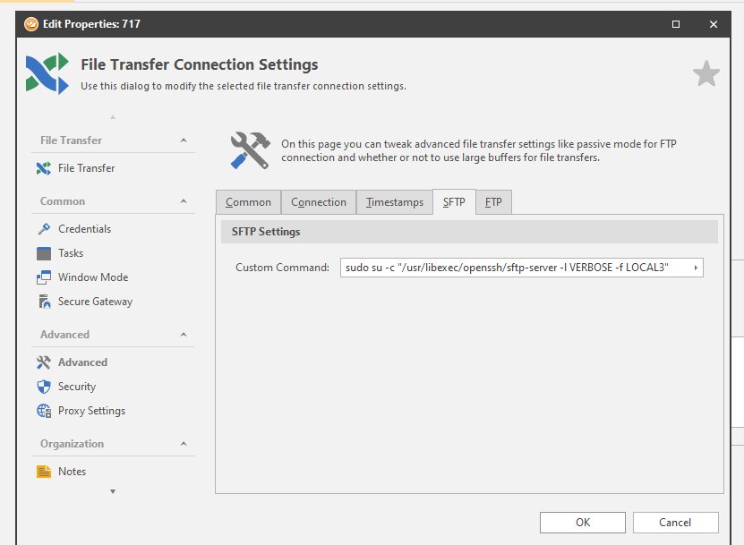

## LOG SFTP CONNECTIONS  

### STAR:  
we had a request to provide sftp with elevated privileges view to users having sudo that connects to transfer files via WINSCP client or ROYALTS  

To achieve that, the trick is to "wrap the SFTP connection inside an SFTP connection"  

  


>**PS**
the verbose and the facility options are very important, otherwise we will only log commands run by the user in non privileged mode  

Finally in **/etc/ssh/sshd_config**:  
```bash
# override default of no subsystems
Subsystem       sftp    /usr/libexec/openssh/sftp-server -l VERBOSE -f LOCAL3
```  


